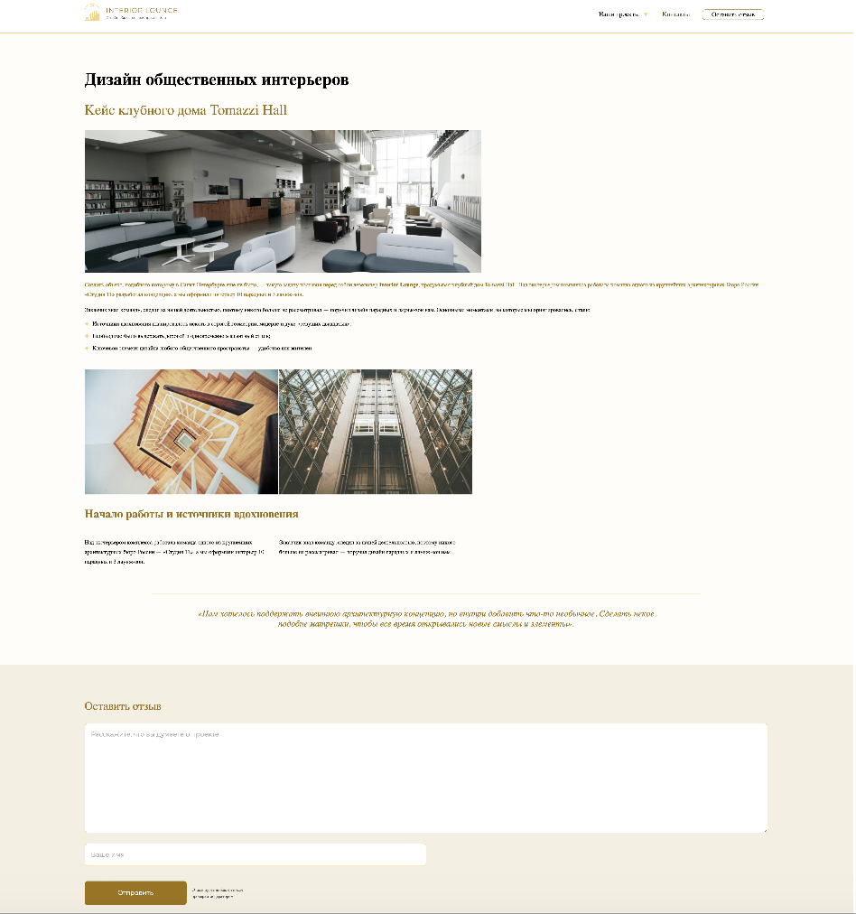

# Interior-Lounge

Решение для [Interior-Lounge](https://interior-lounge.netlify.app).

## Обзор

Cтраница студии дизайна общественных интерьеров

### Скриншот

### Используемые технологии

Подготовка вёрстки под разделение на шаблоны. 
Выделение повторяющихся частей, организация стилей, скриптов и интеграция в CMS.
